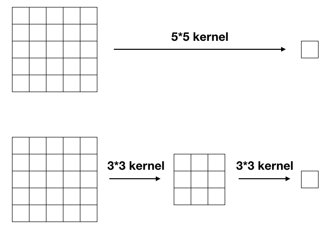

# Image recognition

## Network in network \(NIN\)



* Global average pooling
* 1\*1 convolutional kernel

## Very Deep Convolutional Networks for Large-Scale Image Recognition \(VGG\)



* Simply stacks more convolution layers
* Stack small convolutional kernels to achieve the same "receptive field" as bigger one.
  * Stack two 3\*3 convolutional kernel is equavalent to 5\*5 convolutional kernel 

## Deep Residual Learning for Image Recognition \(Resnet\)



* Add residual connection
* 
## Inception

## Xception

## Dense net

## Squeeze and excitation network

## Dual path network

## Shuffle network

## Squeeze network

## ResXt

## Fully Convolutional Attention Networks for Fine-Grained Recognition

[https://arxiv.org/pdf/1603.06765.pdf](https://arxiv.org/pdf/1603.06765.pdf)

## Residual Attention Network for Image Classification

[https://arxiv.org/pdf/1704.06904.pdf](https://arxiv.org/pdf/1704.06904.pdf)

{% embed data="{\"url\":\"https://github.com/tengshaofeng/ResidualAttentionNetwork-pytorch\",\"type\":\"link\",\"title\":\"tengshaofeng/ResidualAttentionNetwork-pytorch\",\"description\":\"ResidualAttentionNetwork-pytorch - a pytorch code about Residual Attention Network.  This code is based on two  projects from\",\"icon\":{\"type\":\"icon\",\"url\":\"https://github.com/fluidicon.png\",\"aspectRatio\":0},\"thumbnail\":{\"type\":\"thumbnail\",\"url\":\"https://avatars3.githubusercontent.com/u/9246739?s=400&v=4\",\"width\":400,\"height\":400,\"aspectRatio\":1}}" %}



