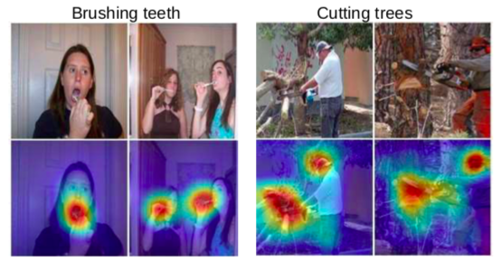

# Interpretability

## Visualizing and Understanding Convolutional Networks

[https://cs.nyu.edu/~fergus/papers/zeilerECCV2014.pdf](https://cs.nyu.edu/~fergus/papers/zeilerECCV2014.pdf)

## Learning Deep Features for Discriminative Localization \(Class activation mapping, CAM\)

[http://cnnlocalization.csail.mit.edu/Zhou\_Learning\_Deep\_Features\_CVPR\_2016\_paper.pdf](http://cnnlocalization.csail.mit.edu/Zhou_Learning_Deep_Features_CVPR_2016_paper.pdf)

Class activation mapping \(CAM\)

* A weakly supervised localization method.
* If the last three layers are "convolution + global average pooling+ full connection\), then you can apply this method to visualize object location.
* Just use fc's weight and calculate weighted sum of convolution feature maps \(without global average pooling\).

